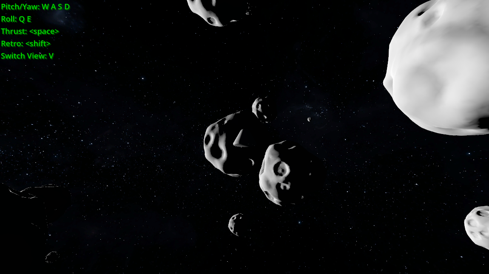

# Asteroid Flyer

A simple game made in godot, using a godot-rust extension.

Fly a command module around the asteroid belt, with full 6-degrees of freedom.
Maybe someday you'll be able to mine them?
